# 데코레이터 패턴(Decorator Pattern)
{: .no_toc }

변화하는 부분 분리하여 통합하기

## Table of contents
{: .no_toc .text-delta }

1. TOC
{:toc}

---

## 상속이 일으키는 문제

음료를 만드는 카페의 주문시스템 중  
```Beverage``` 클래스는 첨가물에 따라 변수/메서드를 지정한다고 하자.  
그리고 각각의 음료 클래스는 ```Beverage``` 클래스로부터 상속받는다고 하자.  

  

이렇게 구조를 짜면 문제가 발생한다.  
첨가물의 종류가 많아지면? 반대로 어떤건 없어진다면? 가격이 바뀌면?  
새로운 음료가 출시될때 어떤 첨가물은 들어가지 말아야한다면?  
첨가물을 여러 번 추가주문하면?  

이는 곧 코드를 확장할 때에 큰 경직을 의미하기도 한다.  
이는 **OCP - 클래스는 확장에는 열려 있어야 하지만 변경에는 닫혀 있어야 한다 -** 를 위배한 구조이다.

---

## 데코레이터 패턴의 도입

### 예시 살펴보기

데코레이터 패턴은 **Wrapper 클래스**의 사용방식과 비슷하다.  
특정 음료에서 첨가물을 도입할때마다 그 음료를 **장식(decorate)**한다고 생각해보자.  
다음 시나리오대로 말이다.  

1. ```DarkRoast``` 객체를 가져온다.

2. ```Mocha``` 객체로 감싼다. (장식한다.)

3. ```Whip``` 객체로 감싼다.

4. ```cost()``` 메서드를 호출한다.  
이 때 첨가물의 가격을 계산하는 일은 해당 객체에게 위임한다.  

  

### 클래스 다이어그램

  

### 정리하기

- 데코레이터의 슈퍼클래스는 자신이 장식하고 있는 객체의 슈퍼클래스와 같다.
- 한 객체를 여러 번 감쌀 수 있다.
- 데코레이터가 자신이 장식하는 객체에게 행동을 위임하는 일 말고도 추가 작업을 수행할 수 있다.
- 객체는 언제든 감쌀 수 있으므로 실행 중에 필요한 데코레이터를 마음대로 적용할 수 있다.

---

## Beverage에 적용하기

데코레이터 패턴을 적용한 클래스 다이어그램은 다음과 같다.  



### 코드 살펴보기

```Beverage``` 클래스를 살펴보자.
```java
public abstract class Beverage {
    String description = "제목없음";

    public String getDescription() {
        return description;
    }

    public abstract double cost();
}
```

첨가물(Condiment)를 나타내는 데코레이터 클래스를 구현해보자.
```java
public abstract class CondimentDecorator {
    Beverage beverage;
    public abstract String getDescription(); // 모든 첨가물에서 새롭게 description을 만들 계획이다.
}
```

음료 코드를 구현해보자. (예시로 ```Espresso```만)
```java
public class Espresso extends Beverage {
    public Espresso() {
        description = "에스프레소";
    }

    public double cost() {
        return 1.50;
    }
}
```

이제 첨가물들을 표현해보자. (예시로 ```Whip```만)
```java
public class Whip extends CondimentDecorator {
    
    public Whip(Beverage beverage) {
        this.beverage = beverage;
    }

    public String getDescription() {
        return beverage.getDescription() + ", 휘핑 추가";
    }

    public double cost() {
        return beverage.getCost() + 0.20;
    }
}
```

예시 테스트 코드는 다음과 같다.
```java
public static void main(String[] args) {

    Beverage beverage = new Espresso();
    beverage = new Whip(beverage); // 휘핑 추가
    beverage = new Whip(beverage); // 휘핑 추가
    beverage = new Mocha(beverage); // 모카 추가
}
```