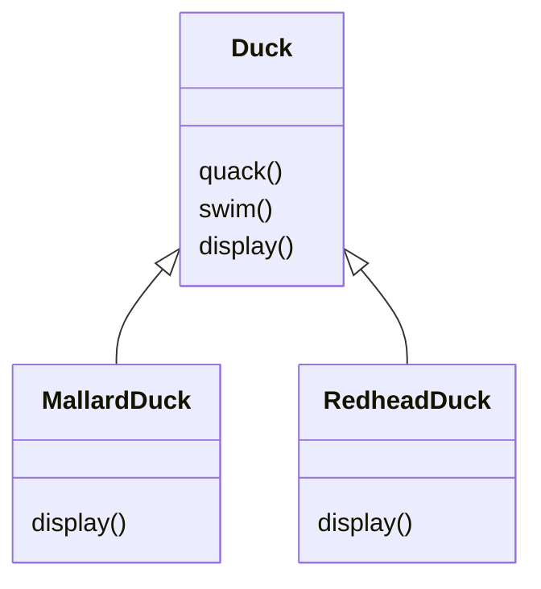
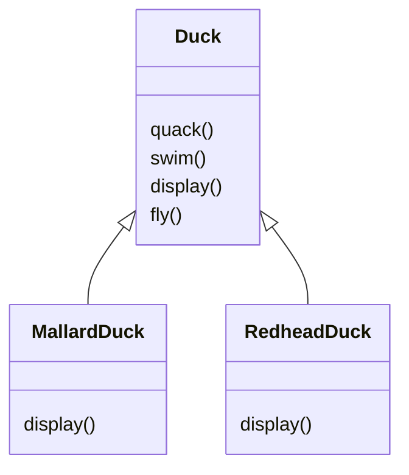
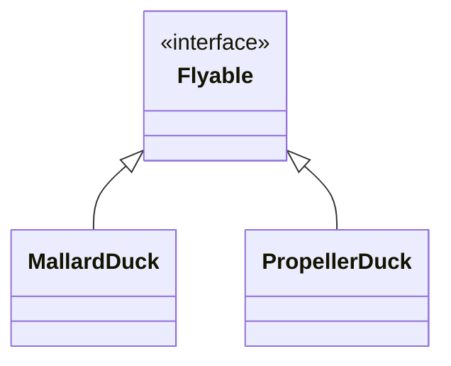
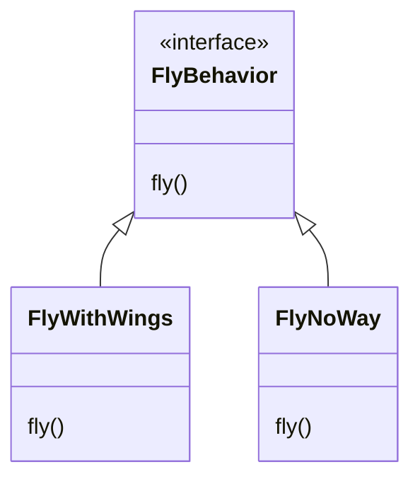
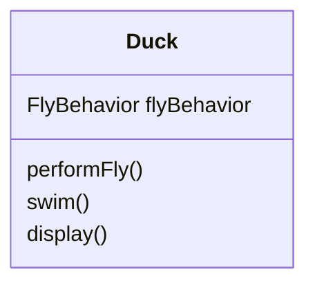

# 전략 패턴(Strategy Pattern)
{: .no_toc }

## Table of contents
{: .no_toc .text-delta }

1. TOC
{:toc}

---

## 상속이 일으키는 문제

SimUDuck이라는 오리 시뮬레이션 게임이 있다.  
이 게임의 ```Duck``` 클래스 구조는 아래와 같다.



이제 오리가 날 수 있도록 하기 위해 ```Duck``` 클래스에 ```fly()```를 추가하였다.



이렇게 한다면 문제가 발생한다. __모든 오리 클래스를 강제로 날아다니도록 만든 것이다.__  
만약 날지 못하는 오리 클래스를 추가할 땐 어떻게 할 것인가?  
이 때 ```fly()```가 아무것도 하지 않도록 오버라이드를 하면 어떨까 생각할 수도 있다.  
그러나 오리 클래스를 추가할 때마다 일일이 특성을 확인하고 오버라이드를 해야할 것이다.

---

## 인터페이스가 일으키는 문제

몇몇의 오리만 날 수 있도록 하기 위해서 인터페이스를 도입해보자.  



그러나 인터페이스를 도입해도 문제점이 생긴다.  

만약 프로펠러로 나는 오리, 날개로 나는 오리 등 날아다니는 행동방식이 여럿이 있다면,  
오리 클래스를 추가할 때마다 같은 방식으로 나는 오리의 코드는 **중복해서 참고**해야 하며,  
다른 방식으로 나는 오리의 코드는 **계속해서 구현부를 수정해야할 것**이다. (OCP 위배)  

또한 이럴 땐 프로그램 실행 중에 동적으로 오리의 행동을 변화시킬 수도 없다.

---

## 변화하는 부분은 따로 분리하기

앞으로 날아다니는 행동 ```fly()```에 많은 변화가 예상될 것이다.  
```fly()```의 알고리즘에 여러가지가 있을 수 있다는 것이다.  
우리는 이 날아다니는 행동만을 목적으로 하는 **클래스의 집합**을 만들 것이다.  

행동(behavior) 인터페이스를 도입해보자.  



우리는 날아다니는 행동들을 각각 **캡슐화(encapsulate)**한 것이다.  
이렇게 하면 ```Duck``` 클래스에 구현을 할 필요가 없어진다.  
또한 **프로그램 실행 시에 행동을 변경할 수 있다는 장점**도 생긴다. (setter로써, [동적으로 행동 지정하기](#동적으로-행동-지정하기)를 참고하자.)  

### 그런데 왜 추상 클래스가 아닌 인터페이스를 사용했을까?

구체적인 구현에 맞출 필요가 없기 때문이다.  
예를 들어서 ```Animal```이 추상 클래스이고, ```Dog```나 ```Cat```같은 구상 클래스가 있다고 하자.  

Dog 인스턴스를 생성하려면 다음과 같이 해야한다.
```java
Dog d = new Dog();
d.bark();
```
추상 클래스 자체는 인스턴스 생성을 못하기 때문에 구현에 맞춰서 코딩해야만 한다.  
<br>

반면 ```Animal```이 **인터페이스**일 때는
```java
Animal animal = new Dog();
animal.makeSound();
```
위처럼 상위형식에 맞춰서 코딩할 수 있다.

---

## 행동 통합하기

이제 ```Duck``` 클래스(또는 그 서브클래스)에서 메서드를 구현하지 않고 **위임**할 것이다.



```java
public abstract class Duck {
    FlyBehavior flyBehavior;

    public void performFly() {
        flyBehavior.fly(); // flyBehavior로 참조되는 객체에 행동 위임
    }
}
```

구상 클래스인 ```MallardDuck```을 살펴보자.
```java
public class MallardDuck extends Duck {

    public MallardDuck() {
        flyBehavior = new FlyWithWings();
    }
}
```

---

## 동적으로 행동 지정하기

이제 프로그램 실행 중에 오리의 행동을 바꿀 수도 있다.  
Duck에 ```setter```를 설정하면, 그 서브 클래스들은 행동을 바꿀 수 있다.

```java
public abstract class Duck {

    public void setFlyBehavior(FlyBehavior fb) {
        flyBehavior = fb;
    }
}

public static void main(String[] args) {
    Duck model = new ModelDuck();
    model.performFly();
    model.setFlyBehavior(new FlyWithPropeller()); // 동적으로 행동 지정
    model.performFly();
}
```

## "구성(composition)을 이용하다"

"A에는 B가 있다"를 생각해보면,  
각 오리에는 FlyBehavior가 있다고 볼 수 있다.  
이런 식으로 두 클래스를 합치는 것을 '구성(composition)을 이용했다'고 부른다.