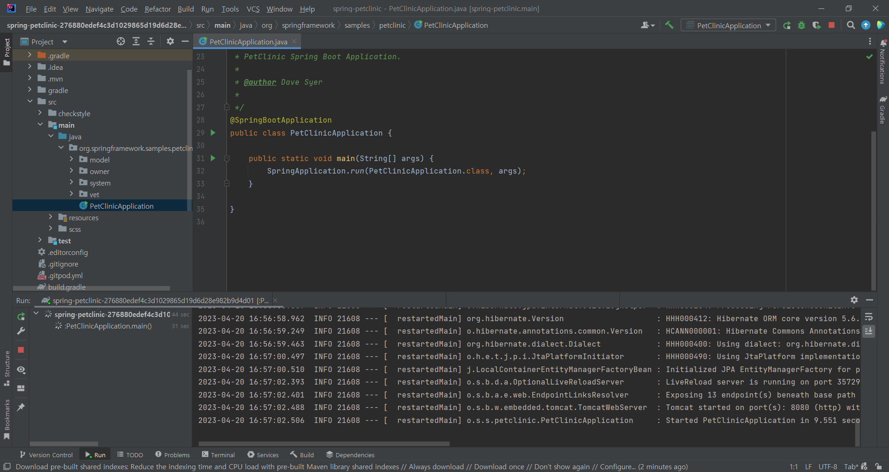
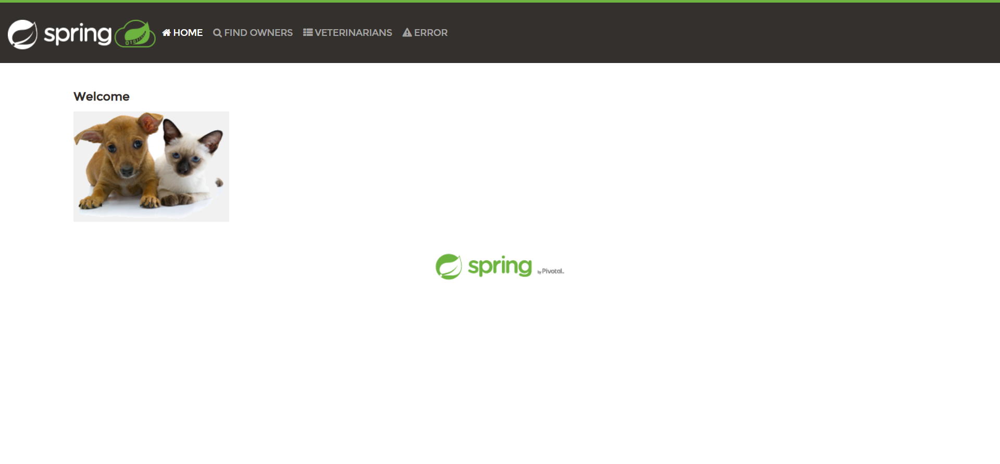
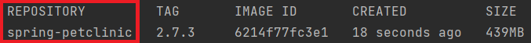
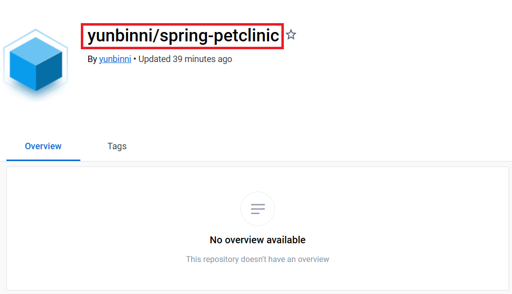
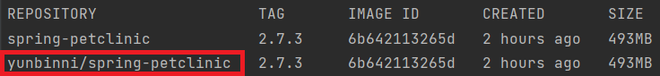
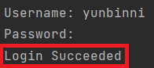
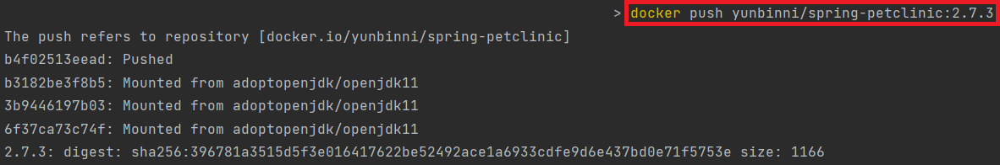
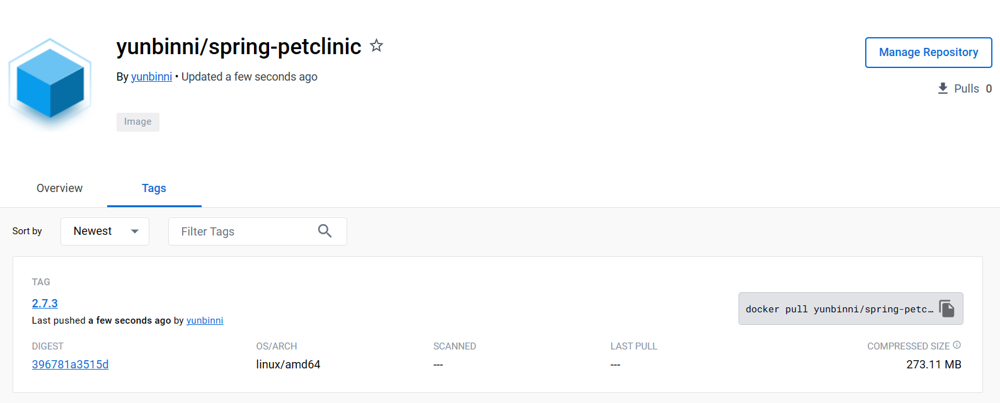

# pet-clinic을 docker로 실행, 배치
{: .no_toc }

스프링 공식 예제인 [pet-clinic](https://github.com/spring-projects/spring-petclinic) 프로젝트를 Docker로 실행해보자.  
편의상 [스프링 부트 버전이 2.7.3이었을때의 pet-clinic](https://github.com/spring-projects/spring-petclinic/tree/276880edef4c3d1029865d19d6d28e982b9d4d01)을 예제삼아서 실습해보았다.

## Table of contents
{: .no_toc .text-delta }

1. TOC
{:toc}

---

## pet-clinic 가져오기

먼저 [pet-clinic - 2.7.3](https://github.com/spring-projects/spring-petclinic/tree/276880edef4c3d1029865d19d6d28e982b9d4d01)에 들어가서 zip 파일을 다운로드받자.  
그리고 자신이 원하는 디렉터리에 가서 압축해제하고, IDE로 로컬환경에서 잘 실행되는지 확인하자.  




아래 사진대로 브라우저에서 잘 실행된다면, pet-clinic을 성공적으로 가져온 것이다.  



---

## Dockerfile 작성

**Dockerfile**은 도커이미지를 빌드하기위한 설계작업을 담고있다.  
명령어 한줄마다 레이어(Layer)를 구성할 것이며,  
한줄씩 실행할때마다 기존의 레이어 위에 쌓아가며 이미지를 만들어나간다고 생각하면 된다.  
(쉽게말해, Dockerfile는 이미지 설계도라고 할 수 있다.)  

이는 **코드로써 인프라스트럭쳐를 구성한다**는 개념으로 볼 수 있다. (IaC - Infra as Code)  

```sh
FROM adoptopenjdk/openjdk11
CMD ["./gradlew", "clean", "package"]
COPY ./build/libs/spring-petclinic-2.7.3.jar spring-petclinic-2.7.3.jar
ENTRYPOINT ["java", "-jar", "spring-petclinic-2.7.3.jar"]
```

위 내용대로 작성된 파일명은 ```Dockerfile```이어야 하며,  
프로젝트 디렉터리 중에서도 최상위에 위치해있어야 한다.

---

## 이미지 빌드하기

이제 우리가 작성한 ```Dockerfile```을 바탕으로 **이미지를 빌드**할 것이다.  
아래 명령어를 우리가 작성한 ```Dockerfile```의 위치에서 터미널로 실행해주자.  

```sh
docker build -f Dockerfile -t spring-petclinic:2.7.3 .
```

이는 "```Dockerfile```이란 파일을 통해 태그는 ```2.7.3```을 붙혀서 이미지를 빌드하겠다"는 뜻이다.  
이미지가 잘 생성되었는지 확인하려면, ```docker images```를 실행해보자.



위와 같이 결과가 나온다면 이미지 빌드에 성공한 것이다.  
이 **이미지를 실행**해보자.  

```sh
docker run -p 8080:8080 spring-petclinic:2.7.3
```

이를 실행하면 이미지에서 **컨테이너가 생성되면서** ```petclinic```이 실행된다.  
만약 ```Docker Desktop```이 설치되어있다면, 실행중인 컨테이너 목록을 볼 수 있다.  
터미널에선 ```docker ps```를 실행해서 확인할 수 있다.  

브라우저에 ```localhost:8080```을 치고 들어가보자.  
이는 프로젝트에 내장된 톰캣 라이브러리로 돌리는 것이 아니라,  
**이미지 내에 빌드된 jar 파일을 통해 도커 환경에서 컨테이너로 돌아가는 것이다!**  

터미널을 한 개 더 열고, 실행중인 컨테이너를 중지시키자.  
```docker ps```로 현재 실행중인 컨테이너의 ID를 확인하고, 다음을 실행하자.  
```sh
docker stop [컨테이너ID]
```

그리고 중지된 컨테이너도 삭제해주자.
```sh
docker rm [컨테이너ID]
```

---

## Docker Hub에 도커이미지 push하기

우리가 빌드한 이미지를 [Docker Hub](https://hub.docker.com/)에 올려보자.(**push**)  
(그전에, 가입은 미리 해두자.)  

그리고 도커허브에 리포지토리를 생성해주자.  
이름은 ```spring-petclinic```.
{: width="80%" }

잠깐 로컬에서 ```docker images```를 입력해보자.  
  

결과에서 보듯이, 도커의 이미지는 ```REPOSITORY```라는 열로서 저장된다.  
이미지 이름은 사실 ```REPOSITORY```인 것이다.  

현재 로컬의 리포지토리와 허브의 리포지토리를 비교하면 아래와 같다.  

|환경|리포지토리|
|---|---|
|허브|yunbinni/spring-petclinic|
|로컬|spring-petclinic|

**push하려면 이 두 리포지토리 값을 동일하게 바꿔줘야한다.**  
로컬에서 다음과 같이 ```tag``` 명령어로 리포지토리 값을 바꿔주자.  

```sh
docker  tag  spring-petclinic:2.7.3  [도커허브 계정이름]/spring-petclinic:2.7.3
```

다시 ```docker images```를 입력해보면 아래와 같이 나올 것이다.  

허브와 같은 이름의 이미지가 하나 더 생긴 것을 볼 수 있다.  
**이걸 push해야한다.**  

이제 로컬에서 **도커허브에 로그인**한 다음, 이미지를 올려보자.

```sh
docker login
```
  

```Login Succeeded```라는 메시지가 출력되었다면,  
**도커허브에 push**해보자.  
  

이제 도커허브에 이미지가 잘 푸시되었는지 확인해보자.


---

## Ubuntu 환경에서 도커이미지 pull 받기

**이 파트는 AWS EC2 인스턴스에서 실습하기 위해 작성된 파트이다.**  