프로그래머스 문제들을 풀어본다.

---

# [카펫](https://school.programmers.co.kr/learn/courses/30/lessons/42842)

## 접근 방식

전체 카펫의 크기는 ```brown```과 ```yellow```를 더한 것과 같다.  
```cpp
int total = brown + yellow;
```

이제 우리가 구하고자 하는  
전체 카펫 크기의 가로를 **W**, 세로를 **H**로 정의해보자.  


이 때 ```brown```은 전체 카펫의 크기 **W × H**에서 ```yellow```의 갯수를 뺀 것과 같고,  
```yellow```는 **(W - 2) × (H - 2)**와 같다.  

이를 정리하면,  
**brown = 2H + 2W - 4**  
**yellow = WH - 2H - 2W + 4**이다.  

이를 충족하는 **W**와 **H**를 ``for``문으로 탐색해서 찾아보았다.

## 전체 소스코드

```cpp
#include <vector>
using namespace std;

vector<int> solution(int brown, int yellow) {
    vector<int> answer;

    int total = brown + yellow;

    for(int H = 1; H*H <= total; ++H) {
        if(total%H == 0) {
            int W = total/H;
            
            if( (brown == (2*H + 2*W - 4)) && (yellow == (W*H - 2*H - 2*W + 4)) )
            {
                answer.push_back(W);
                answer.push_back(H);
            }
        }
    }

    return answer;
}
```

---