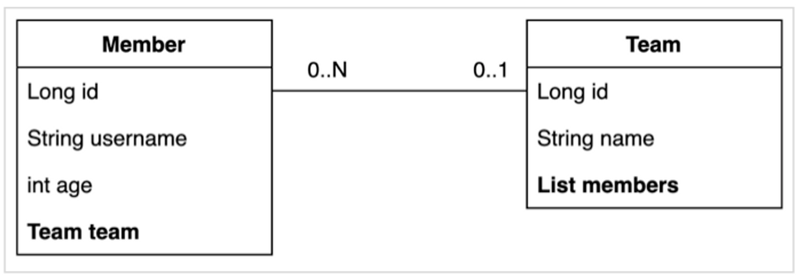
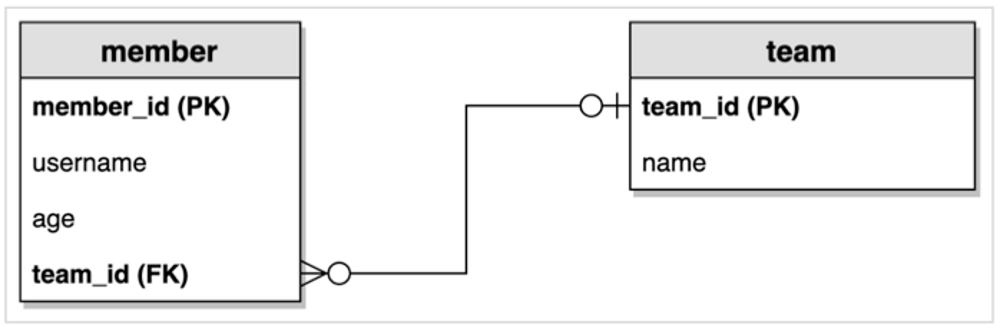

# Querydsl
{: .no_toc }

## Table of contents
{: .no_toc .text-delta }

1. TOC
{:toc}

---

## Querydsl 설정과 검증

```build.gradle```에 다음 설정들을 추가하자.  
[spring 2.x에서 설정하는 법을 참고했다.(인프런)](https://www.inflearn.com/questions/355723/compilequerydsl-%EC%98%A4%EB%A5%98)
```gradle
buildscript {
   ext {
      queryDslVersion = "5.0.0"
   }
}

plugins {
    id "com.ewerk.gradle.plugins.querydsl" version "1.0.10"
}

dependencies {
	implementation "com.querydsl:querydsl-jpa:${queryDslVersion}"
	implementation "com.querydsl:querydsl-apt:${queryDslVersion}"
}

//querydsl 추가 시작

def querydslDir = "$buildDir/generated/querydsl"

querydsl {
    jpa = true
    querydslSourcesDir = querydslDir
}
sourceSets {
    main.java.srcDir querydslDir
}
configurations {
    querydsl.extendsFrom compileClasspath
}
compileQuerydsl {
    options.annotationProcessorPath = configurations.querydsl
}
configurations {
   compileOnly {
      extendsFrom annotationProcessor
   }
   querydsl.extendsFrom compileClasspath
}
//querydsl 추가 끝
```
<br>

이후 ```Gradle```메뉴로 가서  
```querydsl``` > ```Tasks``` > ```other``` > ```compileQuerydsl```을 실행하자.  
프로젝트의 ```build``` > ```generated``` > ```querydsl```에 ```Q엔티티```가 생길 것이다.  
(예제에서는 엔티티가 ```Hello```이기에, Q엔티티는 ```QHello```라고 생겼다.)
<br>

---

## 예제 도메인 모델

엔티티 클래스  


ERD  


```Member``` 엔티티
```java
@Entity
@Getter @Setter
@NoArgsConstructor(access = AccessLevel.PROTECTED)
@ToString(of = {"id", "username", "age"})
public class Member {

    @Id @GeneratedValue
    @Column(name = "member_id")
    private Long id;

    private String username;

    private int age;

    @ManyToOne(fetch = FetchType.LAZY)
    @JoinColumn(name = "team_id")
    private Team team;

    public Member(String username) {
        this(username, 0);
    }

    public Member(String username, int age) {
        this(username, age, null);
    }

    public Member(String username, int age, Team team) {
        this.username = username;
        this.age = age;
        if (team != null) {
            changeTeam(team);
        }
    }
    
    public void changeTeam(Team team) {
        this.team = team;
        team.getMembers().add(this);
    }
}
```
<br>

```Team``` 엔티티
```java
@Entity
@Getter @Setter
@NoArgsConstructor(access = AccessLevel.PROTECTED)
@ToString(of = {"id", "name"})
public class Team {

    @Id @GeneratedValue
    @Column(name = "team_id")
    private Long id;

    private String name;

    @OneToMany(mappedBy = "team")
    private List<Member> members = new ArrayList<>();

    public Team(String name) {
        this.name = name;
    }
}
```
<br>

데이터 확인 테스트
```java
@SpringBootTest
@Transactional
@Commit
public class MemberTest {

    @PersistenceContext
    EntityManager em;

    @Test
    public void testEntity() {
        Team teamA = new Team("teamA");
        Team teamB = new Team("teamB");
        em.persist(teamA);
        em.persist(teamB);

        Member member1 = new Member("member1", 10, teamA);
        Member member2 = new Member("member2", 20, teamA);
        Member member3 = new Member("member3", 30, teamB);
        Member member4 = new Member("member4", 40, teamB);
        em.persist(member1);
        em.persist(member2);
        em.persist(member3);
        em.persist(member4);

        //초기화
        em.flush();
        em.clear();

        //확인
        List<Member> members = em.createQuery("select m from Member m", Member.class).getResultList();

        for (Member member : members) {
            System.out.println("member=" + member);
            System.out.println("-> member.team=" + member.getTeam());
        }
    }
}
```
<br>

---

## 기본 문법

### JPQL vs Querydsl
우선 기본 테스트를 위해 ```Team```과 ```Member```들을 넣을 것이다.

```java
@SpringBootTest
@Transactional
public class QuerydslBasicTest {
    
    @Autowired
    EntityManager em;

    @BeforeEach
    public void before() {
        Team teamA = new Team("teamA");
        Team teamB = new Team("teamB");
        em.persist(teamA);
        em.persist(teamB);

        Member member1 = new Member("member1", 10, teamA);
        Member member2 = new Member("member2", 20, teamA);
        Member member3 = new Member("member3", 30, teamB);
        Member member4 = new Member("member4", 40, teamB);
        em.persist(member1);
        em.persist(member2);
        em.persist(member3);
        em.persist(member4);
    }
}
```
<br>

이 상태에서 먼저 ```JPQL```로 ```member1```을 찾아보겠다.
```java
@SpringBootTest
@Transactional
public class QuerydslBasicTest {
    
    @Test
    public void startJPQL() {
        // member1 찾기
        String qlString =
                "select m from Member m" +
                "where m.username = :username";
        Member findMember = em.createQuery(qlString, Member.class)
                .setParameter("username", "member1")
                .getSingleResult();

        assertThat(findMember.getUsername()).isEqualTo("member1");
    }
}
```
<br>

만약 ```qlString```에서 오타가 난다면  
**실행 시점에서야 ```RuntimeException```이 발생하는 단점이 있다.**  

이제 ```Querydsl```로 ```member1```을 찾아보자.
```java
@SpringBootTest
@Transactional
public class QuerydslBasicTest {

    @Test
    public void startQuerydsl() {
        JPAQueryFactory queryFactory = new JPAQueryFactory(em);
        QMember m = new QMember("m");

        Member findMember = queryFactory
                .select(m)
                .from(m)
                .where(m.username.eq("member1"))
                .fetchOne();

        assertThat(findMember.getUsername()).isEqualTo("member1");
    }
}
```
<br>

이렇게 작성하면 **컴파일 시점에 예외를 미리 확인할 수 있다.**  

참고로 ```startQuerydsl()```에 있는 ```JPAQueryFactory```는 **메서드 밖(필드)로 뺄 수 있다!**
```java
@SpringBootTest
@Transactional
public class QuerydslBasicTest {
    
    JPAQueryFactory queryFactory;
    
    @BeforeEach
    public void before() {
        queryFactory = new JPAQueryFactory(em);
        
        // ...
    }
}
```
<br>

```JPAQueryFactory```를 필드로 제공하면 동시성 문제는 어떻게 될까? 동시성 문제는 JPAQueryFactory를
생성할 때 제공하는 ```EntityManager(em)```에 달려있다. 스프링 프레임워크는 여러 쓰레드에서 동시에 같은
```EntityManager```에 접근해도, **트랜잭션 마다 별도의 영속성 컨텍스트를 제공하기 때문에**, 동시성 문제는
걱정하지 않아도 된다.
<br>

---

## 기본 Q-Type 활용

### Q클래스 인스턴스를 사용하는 2가지 방법
```java
QMember qMember = new QMember("m"); //별칭 직접 지정
QMember qMember = QMember.member; //기본 인스턴스 사용
```
<br>

### 기본 인스턴스를 ```static import```와 함께 사용
```java
import static study.querydsl.entity.QMember.*;

public class QuerydslBasicTest {
    
    @Test
    public void startQuerydsl() {
        Member findMember = queryFactory
                .select(member)
                .from(member)
                .where(member.username.eq("member1"))
                .fetchOne();

        assertThat(findMember.getUsername()).isEqualTo("member1");
    }
}
```
<br>

```Querydsl```도 결국은 ```JPQL```이 되면서 동작한다.  
```JPQL```을 보고 싶다면 다음 옵션을 넣어주자.

```
spring.jpa.properties.hibernate.use_sql_comments: true
```
<br>

```JPQL```을 확인해보면 ```new QMember("m")```처럼 **```"m"```이 ```Alias```임을 확인할 수 있다.**  
따라서 같은 테이블을 조인해야하는 경우엔 기본 인스턴스보단 ```new```로 생성하는 것이 좋고,    
그 외에는 기본 인스턴스를 사용하는 것이 좋을 것이다.

---

## 검색 조건 쿼리

기본 검색 쿼리
```java
@Test
public void search() {
    Member findMember = queryFactory
        .selectFrom(member)
        .where(member.username.eq("member1").and(member.age.eq(10)))
        .fetchOne();
    
    assertThat(findMember.getUsername()).isEqualTo("member1");
}
```
<br>

### JPQL이 제공하는 모든 검색 조건 제공
```java
member.username.eq("member1") // username = 'member1'
member.username.ne("member1") //username != 'member1'
member.username.eq("member1").not() // username != 'member1'
        
member.username.isNotNull() //이름이 is not null
        
member.age.in(10, 20) // age in (10,20)
member.age.notIn(10, 20) // age not in (10, 20)
member.age.between(10,30) //between 10, 30
        
member.age.goe(30) // age >= 30
member.age.gt(30) // age > 30
member.age.loe(30) // age <= 30
member.age.lt(30) // age < 30
        
member.username.like("member%") //like 검색
member.username.contains("member") // like ‘%member%’ 검색
member.username.startsWith("member") //like ‘member%’ 검색
```

### AND 조건을 파라미터로 처리
```java
@Test
public void searchAndParam() {
    List<Member> result1 = queryFactory
        .selectFrom(member)
        .where(
                member.username.eq("member1"),
                member.age.eq(10), null)
        .fetch();
    assertThat(result1.size()).isEqualTo(1);
}
```
<br>

- ```where()```에 검색조건을 추가하면 ```AND```로 엮임
- ```null```값은 무시 → 메서드 추출을 활용해서 동적 쿼리를 만들 수 있음

---
