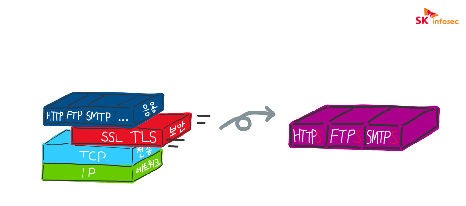

# 용어
{: .no_toc }

## Table of contents
{: .no_toc .text-delta }

1. TOC
{:toc}

---

## 취약점(Vulnerability)
공격자가 시스템의 정보보증을 낮추는데 사용되는 약점

{: .important-title }
> 취약점은 세 요소의 교집합이다.
> 
> 시스템 민감성 또는 결합
> 
> 공격자가 결함에 대한 접근
> 
> 공격자가 결함에 대한 exploit(탈취) 가능성

취약점(보안위협)을 검색하려면 [fortiguard.com](https://www.fortiguard.com/encyclopedia)에서 검색이 가능하다.

---

## CVE(Common Vulnerabilities and Exposures)

{: .warning }
> 공개적으로 알려진 컴퓨터 보안 결함 목록

---

## CVE-ID
[CVE](#cvecommon-vulnerabilities-and-exposures)를 알아보기 위한 식별번호  

{: .note-title }
> CVE-[연도]-[번호]
> 
> CVE-2017-2991

- CVE-ID는 [cve.mitre.org](https://cve.mitre.org)에서 검색이 가능하다.
- 취약점에 대해서 **최소 1개**의 CVE-ID가 언급되는 것이 권장된다.
- 어떤 취약점은 CVE-ID가 없을수도 있고, 어떤 취약점은 여러개의 CVE-ID가 붙어있을 수 있다.

---

## IDC(Internet Data Center)
인터넷 데이터 센터

서버를 한군데에 모아 집중시킬 필요가 있을 때 설립한다.  
ex) 네이버 각, 구글 데이터 센터, 규모가 있는 여러 통신사 등 ..

---

## ISP(Internet Service Provider)
인터넷 서비스 제공자

인터넷 회선 임대를 주로하나, IP할당까지 해주는 곳도 있다.
ex) KT, SKT, LG U+

---

## SSL(Secure Socket Layer)
보안 소켓 계층

암호화 기반의 인터넷 보안 프로토콜이다.
현재 사용되는 TLS의 전신이다.

---

## HTTPS(Hypertext Transfer Protocol + Secure)
[HTTP](https://developer.mozilla.org/ko/docs/Web/HTTP)에 보안이 강화된 프로토콜,  
HTTPS는 SSL(TLS) 프로토콜을 바탕으로 돌아간다.

---

## IP(Internet Protocol)
인터넷 프로토콜

- [OSI 7계층](http://wiki.hash.kr/index.php/OSI_7_%EA%B3%84%EC%B8%B5) 중 **L3**에 위치하고 있다.
- IPv4는 32개의 비트값, 2^32 ≒ 약 43억 개의 주소를 가질 수 있다.
- IPv6는 128개의 비트값, 2^128개의 주소를 가질 수 있다.

---

## 공인IP와 사설IP

공인IP는 국가마다 정해진 대역폭 내에서 ISP가 제공하는 주소,  
사설IP는 공유기 등에서 홈 네트워크의 각 장치에 할당된 주소

---

## 사설 네트워크
사설IP로 구축된 네트워크

---

## VPN(Virtual Private Network)
가상 사설 네트워크

VPN은 인트라넷처럼 사용해주는 기술이다. ([출처](https://library.gabia.com/contents/security/8394/))

---

## SIEM(Security Informatioin and Event Management)

보안 정보 및 이벤트 관리

- 실시간 모니터링
- 이벤트 분석
- 규정준수, 또는 감사 목적의 보안데이터 추적, 로깅

---

## DoS(Denial of Service) 공격
서비스 거부 공격

정상적인 트래픽을 처리할 수 없을 때까지  
대상 시스템을 요청으로 압도하거나 폭주시켜 추가 사용자에 대한 서비스 거부를 초래하는 방식 ([출처](https://www.cloudflare.com/ko-kr/learning/ddos/glossary/denial-of-service/))

{: .important-title }
> DoS의 종류
>
> [DDoS(Distributed Denial of Service) 공격](https://www.hpe.com/kr/ko/what-is/ddos-attack.html)
> 
> 분산 서비스 거부 공격
>
> [DRDoS(Distributed Reflection Denial of Service) 공격](https://namu.wiki/w/%EB%B6%84%EC%82%B0%20%EB%B0%98%EC%82%AC%20%EC%84%9C%EB%B9%84%EC%8A%A4%20%EA%B1%B0%EB%B6%80%20%EA%B3%B5%EA%B2%A9)
>
> 분산 반사 서비스 거부 공격

---

## 방화벽(FireWall, F/W)
미리 정의된 보안규칙에 따라  
들어오고 나가는 트래픽을 모니터링하고 제어하는 네트워크 보안 시슽템

---

## WAF(Web Application FireWall)
웹 방화벽

응용(Application) 계층에서  
악의적 공격, 원치않는 트래픽으로부터 보호해준다.

---

## 봇넷(BotNet)
로봇 네트워크(roBot Network)의 준말  
해커의 명령을 수행하는 **대규모 감염된 디바이스(좀비)** 집단  

모든 APT에서 봇넷은 분명하면서도 은밀한 공격수단이다.

---

## APT(Advanced Persistent Attack)
지능적이고 지속적인 공격

가능한 모든 수단을 동원한다. (제로데이 공격, 악성코드, 소셜엔지니어링 기법 등)  
네트워크에 소량의 트래픽을 흘려 네트워크 구성도를 파악해두었다가 공격을 시도하기도 한다.

---

## AV(Anti Virus)
엔드포인트의 바이러스, 악성코드, 트로이목마 등을 탐지하고 방어하는 솔루션

ex) 안랩 V3, 카스퍼스키 등

---

## EDR(Endpoint Detection and Reponse)
엔드포인트 위협 탐지 및 대응 솔루션

> {: .warning-title }
> AV와 EDR의 차이는?
>
> 백신(AV)은 EDR로 대체될 수 없다.
> AV는 엔드포인트 상의 악성코드 등을 탐지하여 차단/격리하는
> 기본적이고 근본적인 솔루션이다.
>
> 그러나 AV는 악성코드의 감염경로 추적, EP의 로그수집에 제한이 있으며,
> 추가적인 대응에 어려움이 있다.
> 이를 보완하기 위해 EDR이 나온 것이다. ([출처](https://www.ahnlab.com/kr/site/securityinfo/secunews/secuNewsView.do?seq=29718))

---

## DLP(Data Loss Prevention)
정보 유출 방지 솔루션

데이터가 흐르는 경로나 매체를 차단시킨다.

---

## PAM(Previleged Account/Access Management)
특권 계정/접근 관리 시스템

최소한의 자격증명(Credential)이 갖춰졌는지 파악한다.

---

## PoC(Proof of Concept)
개념 실증

어떤 솔루션, 대응책, 프로그램, 프로젝트 등의 결과물이  
실제로 효과/효능이 있는지, 실현가능한지 등  
직접적으로 증명해낸다는 IT용어이다.